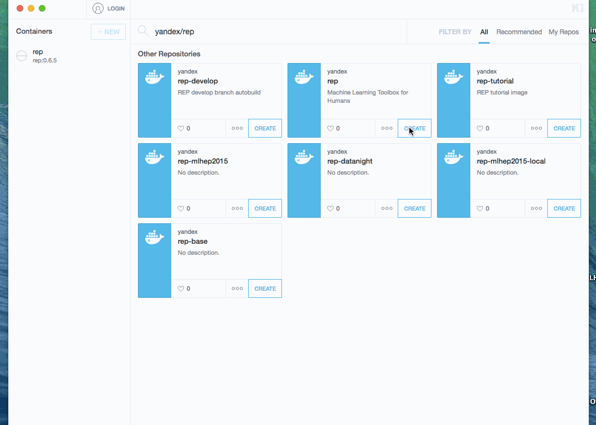

.. _reproducibility:

REProducibility
===============

Problem of reproducing results
------------------------------

One of the hardest problems in research connected with data is to make the research pipeline reproducible.

* Scientific libraries (specially libraries of machine learning) usually either deprecated,
  or evolve and have to break backward compatibility.
  Nobody wants to use old libraries but nobody wants to face problems of evolving libraries.

* Apart from the main libraries you use directly, there are numerous dependencies and dependencies of dependencies.
  Just to give an idea: minimalistic python for data (numpy + scipy + matplotlib) distribution already takes ~1GB.

  The same situation with ROOT / MATLAB / R / any other scientific environment.

* It's not a good idea to hope on setting versions of `pip` dependencies.

  There are numerous dependencies (compilers/linkers/headers/utilities/BLAS/lapack/FFTW/whatever) that
  have effect and that are constantly evolving.

  Creating solid system.

Solution we are using: docker containerization.

Docker image
------------

Docker is a modern-way virtual machine.
It is widely used today to deploy applications due to its flexibility and relative simplicity.

* `what is docker <https://www.docker.com/what-docker>`_ at official site

**REP** is packed into docker container, which is stored in docker hub cloud (image name: yandex/rep).

* `yandex/REP docker image <https://hub.docker.com/r/yandex/rep/>`_

To have fixed environment now it suffices to know version of REP you're using (i.e. 0.6.5).

Using REP + kitematic
---------------------

Docker team ships kitematic - an user-friendly way to execute docker containers on Windows / Mac OS / Linux.

.. note::
    Docker initially is based on linux containers,
    so underneath kitematic uses additional virtual machine on non-linux systems.

    Linux is supported by docker natively, but kitematic is not yet ready for linux
    (so, you'll need to run from terminal)

* `Kitematic official site: <https://kitematic.com/>`_

Shortly, all you need to get running container with REP is:

1. install kitematic
2. search `yandex/rep` image and optionally select needed version
   * downloading an image can take a while!
   * after image is downloaded, it is automatically started
3. click on preview link. This opens a browser with Jupyter.

Process is demonstrated below (docker image was already downloaded, so waiting step is skipped):

